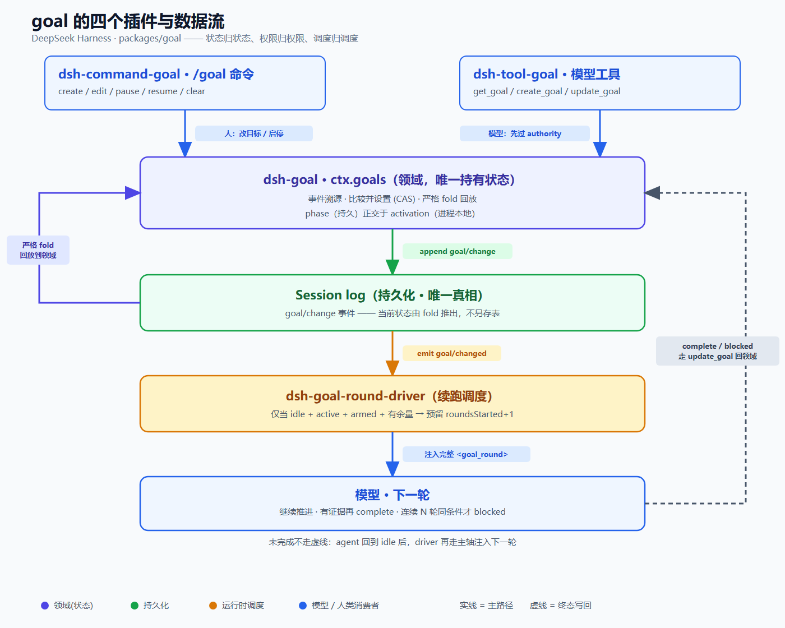
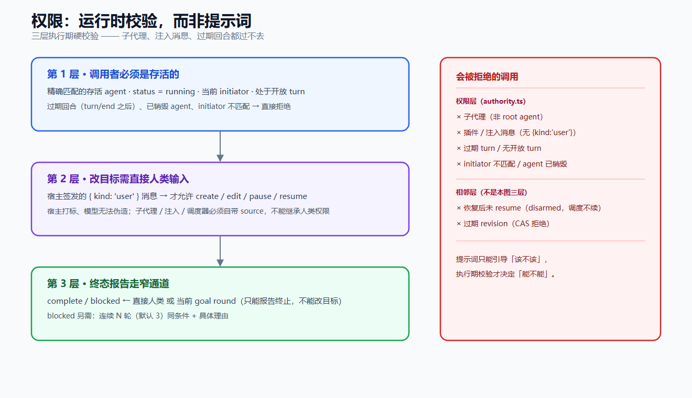

# 让 Agent 盯住一个目标连跑几天，不要去改主循环

给 Agent 加「长期目标」，第一反应通常是改主循环：加一个 goal 分支、加一个计数器、再写一段「请继续完成目标」的提示词。

DeepSeek Harness 的 `packages/goal` 没这么做。`agent-loop` 一行没改。调度、命令、模型工具也都不拥有状态。贯穿始终的一句话是：

**状态可以回放，权限必须重授。**

下面按「根 / 主干 / 分支 / 树叶」拆这套设计。它不是一篇源码导读，而是一组可以搬到别的 harness 上的判断。

---

## 先看整棵树

目标功能不是一个 feature 开关，而是从日志长出来的一棵树：

- **根**：session log 是唯一持久真相
- **主干**：一条可回放的生命周期状态机——现在是什么版本、什么 phase
- **四根分支**：phase（进展到哪）、activation（这一进程还能不能自动续）、authority（谁有资格改 / 停）、round（何时开下一轮、怎么防漂）
- **树叶**：每根分支末端的实现

四根分支必须正交。phase 回答「这个目标走到哪了」，activation 回答「当前这个进程有没有被授权自动续跑」。把「能否自动续跑」写进日志，恢复或 fork 出来的会话就会自己跑起来——这正是这套设计拒绝的事。

---

## 四个插件，loop 一行不改

goal 被切成「一个服务 + 三个消费者」：

- `dsh-goal` 持有状态（`ctx.goals`）
- `dsh-tool-goal`：模型侧 `get_goal` / `create_goal` / `update_goal`
- `dsh-command-goal`：人类 `/goal`
- `dsh-goal-round-driver`：空闲时续跑

后三者都通过公共的 `ctx.goals` 和 `Agent` 服务消费它。新行为走能力接缝，不进循环。

这不是在 loop 里加一个 goal 分支，也不是一个单体 feature。调度、命令、模型工具如果自己存一份状态，重启、回放、权限校验立刻对不齐。

---

## 根：日志即唯一真相

goal 状态不另存一张表。每次变更追加一条 `goal/change` 会话事件，当前状态由事件流 fold 出来。

这里有两道 fold，职责不同：

- **严格 fold**：回放时校验转移合法性，非法立即抛错
- **投影 fold**：只保留最新整份快照，不再校验——因为写入侧已经校验过

这不是 Codex 目标功能那种「每个会话一行 SQLite」。也不是「当前态直接存字段，日志是副产物」。日志是真相，快照是投影。

还有一条更硬的约束：**凡是进入模型请求的内容，都必须能从 session 日志重建。** goal 状态是 `goal/change`；续跑提示是带 goal 来源标记的 `user/message`。只活在内存里、重启即丢、无法回放的 steering，不算目标功能。

提交用比较并设置（CAS），不用加锁串行化。每次变更带 `{ id, revision }`，revision 单调 +1，过期引用直接拒绝。模型被要求先 `get_goal`，再复制精确的 id / revision。后写覆盖在这里是 bug，不是策略。

---

## 关键切割：phase 持久，activation 永不落盘

`phase` 是 `active` / `paused` / `blocked` / `complete`，写进日志，可以回放。

`activation` 是 `armed` / `disarmed`，只存在于当前进程，永不落盘。`session-start` 强制 disarm。

所以会出现这种合法组合：恢复或 fork 出来的会话，phase 仍是 `active`，activation 却是 `disarmed`。它不会自动继续执行。必须等人明确 resume，才会重新 armed。

执行授权绝不随状态一起回放。这就是「状态可回放，权限必须重授」的字面意思。

---

## 权限是运行时签发，不是提示词

改目标、停目标，不靠「请你不要乱改」这类提示词，也不靠持久化的 root / fork 血缘。校验发生在执行期，看的是活着的事实：

1. 调用者必须是精确匹配的存活 agent，状态是 `running`，处在开放 turn
2. 改目标需要当前根 agent 轮次里有宿主签发的 `{ kind: 'user' }` 消息
3. `complete` / `blocked` 额外接受「当前 goal round」这条窄通道——只能报告终止，不能改目标

子代理、插件注入、过期回合，过不去。提示词只能引导「该不该」；执行期校验才决定「能不能」。

`blocked` 还有一道门槛：连续 N 轮（默认 3）同一条件，加上具体理由。模型自己说「我完成了」或「我被挡住了」，都不算。

---

## 续跑：一次一续，每轮重注入完整目标

空闲自启动的四个条件同时成立才驱动下一轮：agent 空闲、phase 为 `active`、activation 为 `armed`、轮次还有余量。每次空闲最多续一次，预留 `roundsStarted + 1`，不排队、不定时轮询、不 busy-loop。

续跑不是空转。每一轮重新注入完整 objective。完成必须拿工作区 / 持久态当权威，先给证据；否则不准 complete。

失败即停。持久化失败、队列失败、驱动异常，都是 disarm / block，不乐观重试。插件拆掉时关闭准入、disarm 全部 goal、取消活动回合，等到真正静下来。

可调参数——比如连续几轮才允许 blocked、默认最多多少轮——是经过校验的配置字段，非法值加载即抛。不是硬编码常量，也不是藏在 `run()` 里的 `?? default`。

phase 转移由 fold 和 service 双重校验：revision 必须 +1、必须落在允许集合里、计数器该保留的保留。操作和命令是封闭联合，漏掉一种在编译期就被 `assertNever` 抓住。散落的布尔标志和字符串比较，撑不住这棵树。

---

## 能搬走的，是判断，不是文件名

把十二个原则压成四句话：

1. **新行为走插件接缝，不进 loop。** 状态只放在 Goal 服务里。
2. **日志是唯一真相。** 当前态是 fold 出来的；模型看见的都必须能回放。
3. **phase 和 activation 必须拆开。** 进展可持久，自动续跑授权只活在当前进程。
4. **权限看活着的事实。** 提示词不是授权，血缘也不是授权。

树叶会随仓库改名、搬家、重写。根和主干如果对了，叶子换掉也还是同一棵树。根和主干如果错了——比如在 loop 里加分支、把 armed 写进日志、用提示词当权限——叶子写得再漂亮，恢复、fork、子代理、空闲续跑都会在同一处裂开。

对照实现时，Codex 的目标功能走的是「每个线程一行 SQLite + 重启后重新 armed」。DeepSeek Harness 走的是「事件流 fold + 重启强制 disarm」。产品契约可以相近（空闲自启动、反漂移、证据先行），持久化与权限的切割可以完全不同。选哪一种，取决于你的 harness 已经把什么当作真相。
