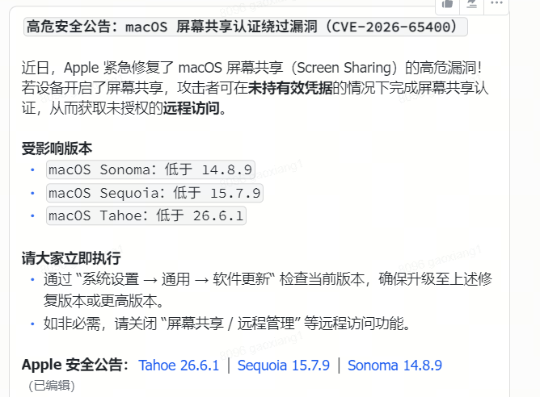

# MacOS升级影响recook和热更包体调研分析

# 背景

MacOS最近修复一个高危漏洞，公司MacOS打包机需要同步升级（26\.3\.1\-\>26\.6\.1）



依据以前升级的情况，MacOS升级会影响到recook，同时出现一次大的热更包的出现，影响开发和用户体验。这里调研了一下源码中具体的影响因素和UE官方的改进方案中是否有可以参考的地方。

**结论：如果MacOS升级前后的 toolchain 版本发生变化，Metal Shader 就需要全部重编，产出较大热更包也是必然的。**

---

# 影响 recook 的因素

> 限定在「打包机 macOS 升级」和项目 UE4\.26\.2 定制版引擎下。
> 
> 

影响因素只有**一个**：**`CompilerVersionString`****（compiler version banner，承载 metal 编译器版本的整行文本）**。只在 macOS 升级连带 **更换 Xcode / CLT / Metal Toolchain 组件 **时才会变。

//TODO： 待确定，升级版本前后 `metal -v` 输出值是否会变化


对于打包跟踪分析平台，

**从 recook 环境角度\(关注环境是否发生变化\)**：

这里最关键的就是**`xcrun metal -v`**** ****首行 \+ target 行 **的输出。如果前后两次打包这里输出不对，就代表环境发生变化，会出现recook（注：这里的分析仅对Metal Shader ）

|采集项|获取方式|是否已有|
|---|---|---|
|执行 cook 的机器名 \+ OS 版本|打包脚本开头几条命令|无|
|**`xcrun metal -v`**** 首行 \+ target 行**（最核心）|`xcrun -sdk iphoneos metal -v`|无|
|Xcode / CLT / Metal Toolchain 版本|`xcodebuild -version` 等|无|
|**Format Version 数值**|解析日志|引擎已打印（`MaterialShader.cpp`**`:`**`p161`）|
|`MATERIALSHADERMAP_DERIVEDDATA_VER` GUID|解析日志|引擎已打印（`MaterialShader.cpp:160`）|

**从 recook 规模角度（关注热更包大小）：**


|采集项|获取方式|是否已有|
|---|---|---|
|本次 DDC miss 的 shader 数 / 占比|引擎日志|无（引擎无汇总日志，只有 VeryVerbose 明细）|
|重编 shader 总数 \+ 耗时|引擎日志|同上|
|产出 shader library 体积|构建产物|无（直接读文件大小即可）|
|**material uasset 变化量**|前后两次构建产物清单 diff|无（diff即可）|


---

# 影响链条分析

## ***recook影响***

计算 DDC key 时，引擎从 `metal -v` 输出中**搜索第一个符合 ****`Apple … version …(…)`**** 形态的行**，取该行**整行文本**，经 `GetTypeHash` 得到 uint32、再把高低 16 位异或**折叠成 16 bit**，写入 `FVersion.XcodeVersion`。所以整行里任何一个字符变动（包括 patch 号）都会改变这 16 bit。

> 该行示例（取自源码注释 `MetalShaderFormat.cpp:644`，为 Windows 交叉编译形态）：
> 
> `Apple metal version 31001.642(metalfe-31001.642-windows)`
> 
> 

一旦这 16 bit 变化，**所有 Metal shader 的 DDC key 都会变，旧缓存无法命中，都需要recook一遍。**

## ***热更影响***

重编之后，热更量取决于字节码是否真的变了。字节码头 `FMetalCodeHeader` 含两个 toolchain 字段：

- `uint32 CompilerVersion` ← **编译器版本**，取 M\.m（patch 已被定制砍掉）

- `uint64 CompilerBuild` ← **AIR target 版本**，取 M\.m\.p（完整保留）

因此只要 **compiler 的 M/m 变**，或 **AIR target 的 M/m/p 任一位变**，字节码就不同，`OutputHash` 随之变化。

OutputHash 全变时，约 **2 万个** material uasset 全部需要重存，产出 **约 2GB** 级别的热更包（预计大小）

# 整体流程

```Apex
FMetalShaderFormat 构造
  └─ FMetalCompilerToolchain::CreateAndInit()          MetalShaderFormat.cpp:94
       └─ Init()                                       :879
            ├─ #if PLATFORM_MAC  DoMacNativeSetup()    :1043  → xcrun -sdk iphoneos --find metal
            │  #else             DoWindowsSetup()      :1062  → C:\Program Files\Metal Developer Tools\ios\bin\metal.exe
            └─ FetchCompilerVersion()                  :967   → 执行 metal -v
                 └─ ParseCompilerVersionAndTarget()    :636   → 解析出 3 个原始字段
                                    │
        ┌───────────────────────────┴───────────────────────────┐
        ▼ 分叉 A：进 DDC key                                     ▼ 分叉 B：进字节码
   GetVersion() :100                                    CompileShader() :115
     └─ GetMetalFormatVersion() :527                      └─ BuildMetalShaderOutput()
          └─ FVersion(uint32)                                  └─ Header.CompilerVersion/CompilerBuild :516
               └─ MaterialShader.cpp:144 → DDC key                  └─ GenerateOutputHash() ShaderCore.cpp:464
                                                                         └─ ShaderHashes → uasset ShaderResource.cpp:343
```

## DDC key计算

`MetalShaderFormat.cpp:562-591`：

```C++
const FString& CompilerVersionString = FMetalCompilerToolchain::Get()->GetCompilerVersionString(ShaderPlatform);
union HashMe { struct { uint16 top; uint16 bottom; }; uint32 Value; };
HashMe V;
V.Value = GetTypeHash(CompilerVersionString);   // ← 整串做 hash
uint16 HashValue = V.top ^ V.bottom;            // ← 折叠成 16 bit

if (!FApp::IsEngineInstalled() && bAddXcodeVersionInShaderVersion)
{
    HashValue ^= TargetVersion.Major;           // 项目未开此开关，不生效
    HashValue ^= TargetVersion.Minor;
    HashValue ^= TargetVersion.Patch;
}

Version.Version.XcodeVersion = HashValue;  //唯一的变量
Version.Version.Format       = FMetalShaderFormat::HEADER_VERSION;   // 71
Version.Version.HLSLCCMinor  = HLSLCC_VersionMinor;                  // 73
```

这个 `uint32` 经 `ShaderFormatVersion(Format)` 拼进 material shader map 的 DDC key（`Runtime/Engine/Private/Materials/MaterialShader.cpp:141`）：

```C++
static FString GetMaterialShaderMapKeyString(const FMaterialShaderMapId& ShaderMapId, EShaderPlatform Platform, const ITargetPlatform* TargetPlatform)
{
    FName Format = LegacyShaderPlatformToShaderFormat(Platform);
    FString ShaderMapKeyString = Format.ToString() + TEXT("_") + FString(FString::FromInt(GetTargetPlatformManagerRef().ShaderFormatVersion(Format))) + TEXT("_"); // 这里就是最后加入到 DDC key计算的字符串

    ShaderMapAppendKeyString(Platform, ShaderMapKeyString);
    ShaderMapId.AppendKeyString(ShaderMapKeyString);
    FMaterialAttributeDefinitionMap::AppendDDCKeyString(ShaderMapKeyString);
    return FDerivedDataCacheInterface::BuildCacheKey(TEXT("MATSM"), MATERIALSHADERMAP_DERIVEDDATA_VER, *ShaderMapKeyString);
}
```

**因为 ****`GetTypeHash`**** 吃整串**，`metalfe-31001.642` 里任何一个字符变了 key 就变 。

> material DDC key 参与计算的具体参数列表
> 
> 

|\#|成分|装什么|macOS 升级时会变吗|
|---|---|---|---|
|1|`Format.ToString()`|shader format 名（`SF_METAL` / `SF_METAL_MRT`…）|**不会** —— 由项目 `TargetedRHIs` 决定|
|2|`ShaderFormatVersion(Format)`|`FVersion uint32：XcodeVersion(16) | HLSLCCMinor(8) | Format(8)`|**只有 ****`XcodeVersion`**** 那 16 位会变** ← 唯一变量|
|3|`ShaderMapAppendKeyString`|`_MTLSTD3_` `_IAB0` `_ARCHIVE` 等 ini/CVar|不会 —— 项目配置|
|4|`ShaderMapId.AppendKeyString`|材质静态开关、`.usf` SourceHash、贴图引用 hash…|不会 —— 内容决定|
|5|`MaterialAttributeDefinitionMap`|材质属性定义表|不会|
|6|`MATERIALSHADERMAP_DERIVEDDATA_VER`|人工 GUID `01BF92A5…`|不会 —— 改引擎才变|

## 字节码计算

写入点 `MetalShaderCompiler.cpp:516-517`：

```C++
Header.CompilerVersion = FMetalCompilerToolchain::Get()->GetCompilerVersion((EShaderPlatform)ShaderInput.Target.Platform).Version;
Header.CompilerBuild   = FMetalCompilerToolchain::Get()->GetTargetVersion((EShaderPlatform)ShaderInput.Target.Platform).Version;
```

随字节码序列化 `MetalShaderResources.h:328-329` / `:385-386`：

```C++
struct FMetalCodeHeader
{
    uint64 CompilerBuild;      // = PackedTargetVersion.Version
    uint32 CompilerVersion;    // = PackedCompilerVersion.Version
    uint32 SourceLen;
    uint32 SourceCRC;
    ...
};
Ar << Header.CompilerBuild;
Ar << Header.CompilerVersion;
```

字节码整体被 hash 成 `OutputHash`（`ShaderCore.cpp:464-479`）：

```C++
void FShaderCompilerOutput::GenerateOutputHash()
{
    FSHA1 HashState;
    HashState.Update(Code.GetData(), ShaderCodeSize * Code.GetTypeSize());   // 含上面那个头
    ParameterMap.UpdateHash(HashState);
    HashState.Final();
    HashState.GetHash(&OutputHash.Hash[0]);
}
```

`OutputHash` 被**无条件写进 cooked uasset**（`ShaderResource.cpp:343` 与 `:165-171`）：

```C++
void FShaderMapResourceCode::Serialize(FArchive& Ar, bool bLoadedByCookedMaterial)
{
    Ar << ResourceHash;
    Ar << ShaderHashes;      // ← OutputHash 列表，无条件序列化进 uasset
    Ar << ShaderEntries;
}
void FShaderMapResourceCode::Finalize()
{
    Hasher.Update((uint8*)ShaderHashes.GetData(), ShaderHashes.Num() * sizeof(FSHAHash));
    Hasher.GetHash(ResourceHash.Hash);
}
```

项目开启 `bShareMaterialShaderCode=True`（`UE_game/Config/DefaultGame.ini:102`），字节码已剥离到独立 shader library，uasset 里只留 `OutputHash` 作索引 —— **但索引就是字节码指纹本身，指纹变则 uasset 全变**。

---

# UE5\.8 \.1中的优化方案

> 项目流程图（左），UE5\.8流程图（右）
> 
> 


## 项目和UE5\.8\.1对比

### **DDC key 层（决定要不要重编）**

**使用整行字符串参与计算 ——\> 只使用Major版本号参与计算**


5\.8 解析时仍保留完整的 `PackedVersion{Major, Minor, Patch}`，但计算 Shader Format Version 时**只用 ****`Major`**，并额外提供 ini 开关 `UseFullMetalVersionInShaderVersion`，开启后才把 Minor / Patch 混进来。

官方原注释（`MetalShaderFormat.cpp:110-111`）：

> *"Only use Metal major version \(e\.g\. Installed build\)\. Since Metal minor/patch version changes every Xcode minor version, we don't want users to rebuild shaders for every minor version update"*
> 
> 

（这个优化方向挺可靠的，看了UE5\.7和UE5\.8都有这个逻辑。UE官方是依据苹果版本更新规律，同 Major 版本内保持编译器编译行为一致，以此优化的。
从我们当前问题——macOS升级会产出较大热更包来说，这里是从**直接原因**解决，**DDC key计算在升级前后保持一致，即不重编，也不产出热更包。**
风险可能就在于如果编译器编译行为发生改变，不同的打包机DDC key一致，但是两个的字节码不一致，会导致混乱和莫名出现的热更包情况）

### **字节码层（决定重编后要不要热更）**

**存储toolchain版本参与计算 ——\> 不存 toolchain 版本。**


5\.8 的 `FMetalCodeHeader` 里**没有 ****`CompilerVersion`**** / ****`CompilerBuild`**** 这两个字段 **。头里剩下的 `Version` 字段装的是 hlslcc / MSL 语言版本（来自 `FHlslccMetalHeader CCHeader(Version)`），与 toolchain 无关。

（这里的优化方向是从**根本原因**解决，当前字节码头的计算由于和toolchain版本绑定，导致了一旦版本发生变化，字节码就有差异，就会产出热更包。

UE5\.8\.1中的做法就是让其和 tollchain 直接脱敏，即便重编了，当其他没发生变化的情况下，前后字节码仍然一致，不会产出热更包）


## 

