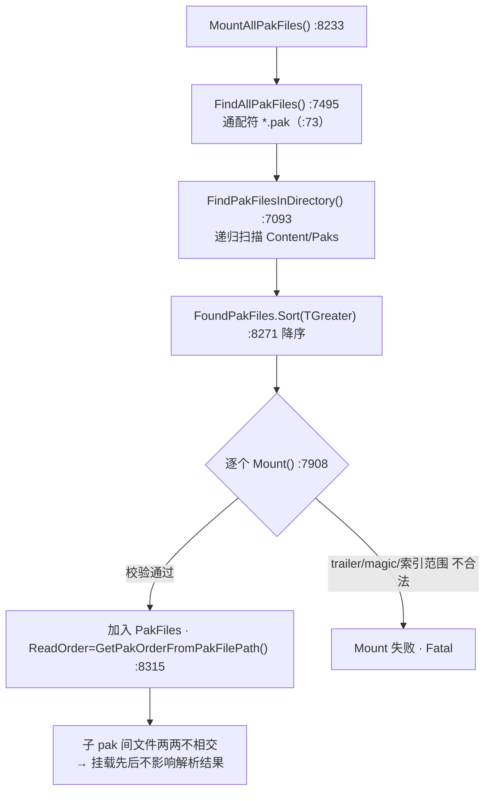
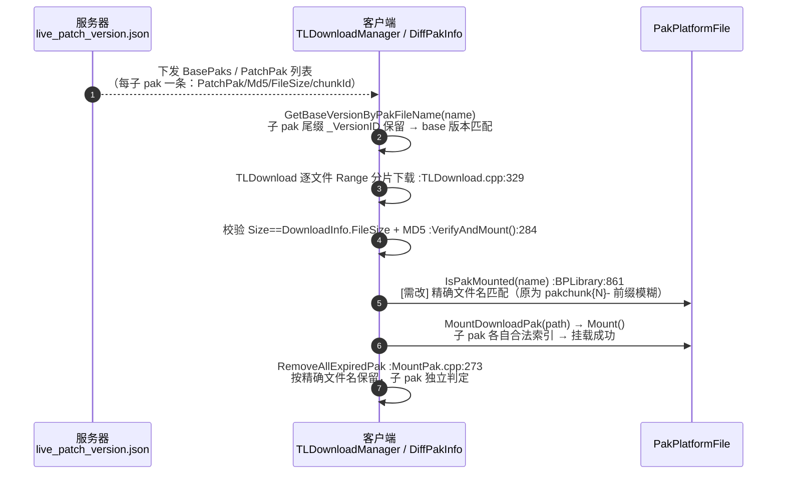
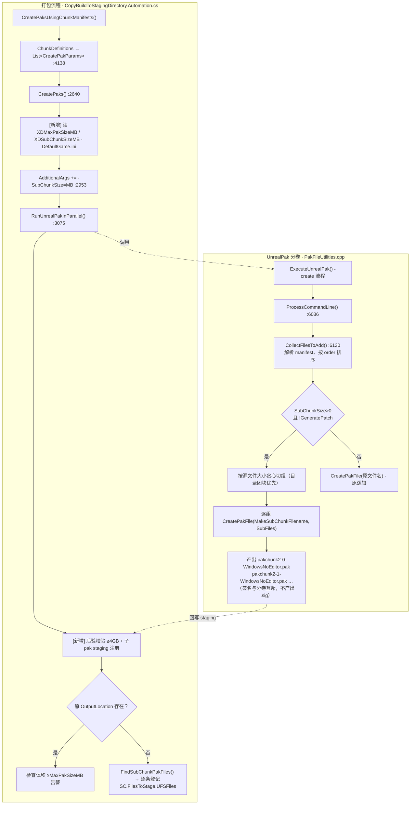

# S16 SubPak：超 4GB Pak 拆分方案调研分析

# 背景

先行服包 `D:\XD\火炬先行服\UE_game\Content\Paks\pakchunk2-WindowsNoEditor.pak` 超过 4GB，超出发布/CDN/下载侧的单文件限制。

与引擎侧对齐后的诉求（何义峰 / 俞航讨论结论）：

> 俞航：拆包，解析包超 4G 的资产大小分布，根据分包规则看超过 4G 的能怎么分……
> 何义峰：**后验**，不要改规则。相当于一个规则超过 4g 之后有个分卷逻辑。
> 俞航：后验，大包改成多个小包（2G）。

**结论：引擎 pak 格式本身没有字节级分卷能力，但"内容级拆分"可行——一个逻辑 chunk 产出多个独立完整、可照常挂载的子 pak（subchunk）。命名只需满足现有文件名解析器（chunk 索引 / base 版本 / `_P.pak` 版本），子 pak 即对引擎、下载、热更全链路透明；在 UnrealPak 增加 `-SubChunkSize=`、并在打包流程 `CopyBuildToStagingDirectory.Automation.cs` 增加 >=4GB 检查与子 pak staging 注册即可落地。**

---

# 影响拆分的因素

> 限定在项目定制 UE4 引擎（`Editor\Engine` 路径）与 TorchLight 打包 / 热更链路下。

**从拆分可行性角度（关注命名与挂载是否受影响）：**

|采集项|获取方式|是否已有|
|---|---|---|
|pak 内资产大小分布|UnrealPak `-List -SizeFilter=0 -csv=`|已有封装 `DumpPakFileListToCsv()`（XDLivePatchPakUtil.cpp:1091）|
|chunk 索引解析规则|`GetPakchunkIndexFromPakFile`（PakFileUtilities.cpp:3711 / IPlatformFilePak.cpp:102）|引擎已有|
|base 版本解析规则|`GetBaseVersionByPakFileName`（XDLivePatch:344 / TorchLight:490）|引擎/插件已有|
|`_P.pak` 版本优先级解析|`Mount()`（IPlatformFilePak.cpp:7929）|引擎已有|
|Android base 命名约定|解包 APK 实测（UnrealPakViewer 缓存）|已确认 `pakchunk{N}-Android_ASTC_{VersionID}.pak`|
|挂载顺序规则|`GetPakOrderFromPakFilePath` + `Sort(TGreater)`（IPlatformFilePak.cpp:8315 / :8271）|引擎已有|

**从热更 / 热更新适配角度（关注拆分后链路是否要改）：**

|采集项|获取方式|是否已有|
|---|---|---|
|服务器版本清单|`live_patch_version.json` 生成（XDLivePatcher.cpp:502-516）|已有（需逐子 pak 下发）|
|下载 / MD5 / 大小校验|`TLDownloadManager::Init`（TLDownloadManager.cpp:104-130）|已有（天然按文件名逐条）|
|`IsPakMounted` 判定|TorchLightHotUpdateBPLibrary.cpp:861|已有（**需改为精确文件名匹配**）|
|过期清理|`RemoveAllExpiredPak`（MountPak.cpp:273）|已有（按精确文件名保留，天然适配）|
|base 版本检测|`GetDownloadedBaseVersion`（DiffPakInfo.cpp:183）|已有（版本尾缀保留即可）|

---

# 影响链条分析

## pak 格式与分卷可行性

引擎没有原生"单 pak 字节级分卷"能力：

- `CreatePakFile()`（PakFileUtilities.cpp:2371）一次只写一个完整 pak：文件头 + 文件数据 + 尾部索引（FPakInfo 在文件末尾，`FPakFile::Initialize` IPlatformFilePak.cpp:5251 从 `CachedTotalSize - Info.GetSerializedSize()` 读 trailer）。
- 全文件检索无 `Subchunk / Split / MaxFileSize / VolumeSize` 逻辑，UnrealPak 命令行没有体积上限参数。
- `FPakInfo`（IPlatformFilePak.h:82）中 `IndexOffset / IndexSize` 为 int64；`FPakEntry::Offset / Size / UncompressedSize`（:373-377）均为 int64，格式本身支持 >4GB 单文件。

> 因此 4GB 限制**不是 pak 格式硬限制**，而是发布/下载/CDN/平台侧约束。拆分必须走"内容级拆分"（一个逻辑 chunk 产出多个**独立完整**的 pak 文件），而不是字节切卷。

## 子 pak 挂载

`MountAllPakFiles()`（IPlatformFilePak.cpp:8233）→ `FindAllPakFiles()`（:7495）→ `FindPakFilesInDirectory()`（:7093）以通配符 `ALL_PAKS_WILDCARD = "*.pak"`（:73）**递归扫描** Content/Paks 目录下所有 `.pak` 并逐个 `Mount()`。

- 每个子 pak 是带独立索引的合法 pak，放对目录即可挂载。
- `Mount()`（:7908）校验 trailer/magic/索引范围，子 pak 各自满足即可。



## 命名解析器约束（关键）

现有文件名解析器（引擎 + 热更插件）对子 pak 命名的约束：

|解析器|位置|解析规则|对子 pak 命名要求|
|---|---|---|---|
|`GetPakchunkIndexFromPakFile`|引擎 :3711 / 运行时 :102|`pakchunk` 前缀后、第一个 `-` 前的子串必须纯数字|`pakchunk2-0-WindowsNoEditor.pak` → 解析为 **2** ✓|
|`GetPakOrderFromPakFilePath`|引擎 :8315|只看目录前缀|子 pak 同目录 → 同优先级 ✓|
|`Mount()` `_P.pak` 优先级|引擎 :7929|`_{ver}_P.pak`，版本为 `_P.pak` 前一段|子序号放版本段之前：`{name}_s0_{ver}_P.pak` ✓|
|`GetVersionByPakFileName`|XDLivePatch:314|同上|同上 ✓|
|`GetBaseVersionByPakFileName`|XDLivePatch:344 / TorchLight:490|`pakchunk*` 文件名最后一个 `_` 前数字 = base 版本|**必须保留 `_{VersionID}` 尾缀**|
|`TLDownloadManager::Init` chunkId|TorchLightInGameDownload:126-130|`Find("-")`，取 `pakchunk{N}` 前缀|`pakchunk2-0-...` → chunkId 2 ✓|
|`IsPakMounted`|TorchLight:861|`Mid(0, Find("-")+1)` 前缀匹配|**需改为精确文件名匹配**|

**各平台 base / 热更 pak 命名（真实目录实测）**：

|平台|目录|真实文件名（节选）|命名规则|子 pak 命名|
|---|---|---|---|---|
|PC base|`D:\XD\火炬先行服\UE_game\Content\Paks`|`pakchunk0-WindowsNoEditor.pak`、`pakchunk2-WindowsNoEditor.pak`、`pakchunk999-WindowsNoEditor.pak`、`pakchunk1000-WindowsNoEditor.pak`|`pakchunk{N}-WindowsNoEditor.pak`（**无版本号**）|`pakchunk{N}-{sub}-WindowsNoEditor.pak`|
|Android base|`...cache\5612870_android_TLPreview`|`pakchunk0-Android_ASTC.pak`（无版本）、`pakchunk2-Android_ASTC_5612870.pak`、`pakchunk777-Android_ASTC_5612870.pak`|`pakchunk{N}-Android_ASTC_{VersionID}.pak`|`pakchunk{N}-{sub}-Android_ASTC_{VersionID}.pak`|
|iOS base|`...cache\5612870_ios_Release`|`pakchunk3-ios_5612870.pak`、`pakchunk777-ios_5612870.pak`、`pakchunk1000-ios_5612870.pak`|`pakchunk{N}-ios_{VersionID}.pak`（**无纹理格式段**）|`pakchunk{N}-{sub}-ios_{VersionID}.pak`|
|热更 pak|`D:\XD\火炬先行服\UE_game\Torchlight\Saved\PersistentDownloadDir\PreMountPak`|`UE_game_4994188_P.pak`、`UE_game_4999343_P.pak`|`{ProjectName}_{VersionID}_P.pak`|`{ProjectName}_s{sub}_{VersionID}_P.pak`|

- base 包三段式：`pakchunk{N}-{平台段}-{版本段?}`，平台段因平台而异（`WindowsNoEditor` / `Android_ASTC` / `ios`），PC 无版本段、Android/iOS 带 `_{VersionID}`。
- `GetBaseVersionByPakFileName` 依赖尾部 `_{VersionID}`（Android/iOS），PC 无版本段则返回 -1 属正常。
- 子 pak 命名规则统一为：**在 chunk 号后插 `-{sub}`**（base），**在版本段前插 `_s{sub}`**（热更 `_P.pak`）。各解析器验证：

|解析器|`GetPakchunkIndexFromPakFile`|`GetBaseVersionByPakFileName`|`GetVersionByPakFileName`|
|---|---|---|---|
|PC 子 pak `pakchunk2-0-WindowsNoEditor.pak`|2 ✓|—（无版本段）|—|
|Android 子 pak `pakchunk2-0-Android_ASTC_5612870.pak`|2 ✓|5612870 ✓|—|
|iOS 子 pak `pakchunk2-0-ios_5612870.pak`|2 ✓|5612870 ✓|—|
|热更子 pak `UE_game_s0_4994188_P.pak`|—|—|4994188 ✓|

## 加载顺序（子 pak 命名不影响）

- 子 pak 与原 pak 同目录 → `GetPakOrderFromPakFilePath` 返回相同基础优先级。
- `FoundPakFiles.Sort(TGreater<FString>())`（:8271）降序：`pakchunk2-1-...` 先于 `pakchunk2-0-...`，但子 pak 内容**两两不相交**（文件查找按 ReadOrder 顺序找第一个命中），挂载先后不影响解析结果。
- `_P.pak` 版本优先级 `PakOrder += 100*ChunkVersionNumber` 按版本号提升，子 pak 版本相同 → 优先级一致。
- 唯一要求：**拆分后原大 pak 不再保留**，避免与任一子 pak 重复含同一文件导致顺序歧义。

## 热更链路现状

- 出包侧 `XDLivePatchEditor`：`SplitPackageInfo`（XDLivePatchChunkUtil.cpp:11）按 ChunkRules 拆 chunk，但无体积控制；`GeneratePatchPakFile`（XDLivePatchPakUtil.cpp:60）对每个 chunk 用 UnrealPak `-create=` 生成**单个** `..._P.pak`；:442-458 仅对生成后大小与 `PatchPakSizeThresholdMB` 做告警，不拆分。
- 下载/挂载侧：按文件名（PatchPak）逐文件下载 + MD5/大小校验；`TLDownloadManager` 从 `pakchunk{N}-` 解析 chunkId；`MountAllDownloadPak`（MountPak.cpp:49）按文件名逐个挂载；`IsPakMounted` 前缀模糊匹配；`RemoveAllExpiredPak`（:273）按 `HotUpdateFiles` 精确文件名保留。



---

# 整体流程



---

# 引擎侧实现：UnrealPak `-SubChunkSize=` 分卷

## 改动点

- 文件：`Editor\Engine\Source\Developer\PakFileUtilities\Private\PakFileUtilities.cpp`
- 位置：主流程 `if (NonOptionArguments.Num() > 0)` 内，`CollectFilesToAdd`（:6130）与 GeneratePatch 处理之后、`CreatePakFile`（:6177）之前。
- 命令用法：

```
UnrealPak.exe "pakchunk2-WindowsNoEditor.pak" -create=manifest.txt -SubChunkSize=2048 [原有压缩/加密/签名参数]
```

## 子 pak 输出命名

`MakeSubChunkFilename`：base 包在 chunk 号后插 `-{sub}`（保 `pakchunk{N}-` 前缀与 `_{VersionID}` 尾缀）；补丁包在版本段前插 `_s{sub}`（保 `_P.pak` 尾缀）：

```C++
FString MakeSubChunkFilename(const FString& PakFilePath, int32 SubChunkIndex)
{
    FString Dir = FPaths::GetPath(PakFilePath);                    // 保持输出目录不变
    FString Clean = FPaths::GetCleanFilename(PakFilePath);
    FString Ext = FPaths::GetExtension(Clean, /*bIncludeDot=*/true);   // ".pak"

    FString SubChunkClean;
    // base 包：pakchunk{N}-{sub}-{Platform}[_{VersionID}].pak
    if (Clean.StartsWith(TEXT("pakchunk")))
    {
        int32 DashIdx = INDEX_NONE;
        if (Clean.FindChar(TEXT('-'), DashIdx) && DashIdx > 0)
        {
            FString Base = Clean.Left(DashIdx);                    // "pakchunk2"
            FString Rest = Clean.Mid(DashIdx + 1, Clean.Len() - DashIdx - 1 - Ext.Len()); // "WindowsNoEditor" / "Android_ASTC_5612870"
            SubChunkClean = Base + TEXT("-") + FString::FromInt(SubChunkIndex) + TEXT("-") + Rest + Ext;
        }
    }
    // 补丁包：{ProjectName}_s{sub}_{VersionID}_P.pak
    // 版本段 = _P.pak 前最后一段；_s{sub} 插在版本段之前，保持 _P.pak 尾缀与版本解析
    if (SubChunkClean.IsEmpty() && Clean.EndsWith(TEXT("_P.pak")))
    {
        FString Body = Clean.LeftChop(6);                          // 去掉 "_P.pak" → "UE_game_4994188"
        int32 VersionIdx = INDEX_NONE;                             // 最后一个下划线（版本段前）
        if (Body.FindLastChar(TEXT('_'), VersionIdx) && VersionIdx > 0)
        {
            FString NamePart = Body.Left(VersionIdx);              // "UE_game"
            FString VersionPart = Body.RightChop(VersionIdx + 1);  // "4994188"
            SubChunkClean = NamePart + TEXT("_s") + FString::FromInt(SubChunkIndex)
                + TEXT("_") + VersionPart + TEXT("_P.pak");        // "UE_game_s0_4994188_P.pak"
        }
        else
        {
            // 无版本段的 _P.pak 兜底
            SubChunkClean = Body + TEXT("_s") + FString::FromInt(SubChunkIndex) + TEXT("_P.pak");
        }
    }
    // 兜底：扩展名前插入
    if (SubChunkClean.IsEmpty())
    {
        SubChunkClean = Clean.LeftChop(Ext.Len()) + TEXT("_s") + FString::FromInt(SubChunkIndex) + Ext;
    }
    return Dir / SubChunkClean;
}
```

## 分卷主逻辑

```C++
// ---- 主流程插入（:6177 CreatePakFile 之前）----
int64 SubChunkSizeMB = 0;
FParse::Value(CmdLine, TEXT("SubChunkSize="), SubChunkSizeMB);

if (SubChunkSizeMB > 0 && !CmdLineParameters.GeneratePatch)
{
    const int64 SubChunkLimitBytes = SubChunkSizeMB * 1024 * 1024;

    // 用原始文件大小作为输出体积的保守上界（压缩只会更小）
    TArray<int64> EntrySizes;
    EntrySizes.Reserve(FilesToAdd.Num());
    for (const FPakInputPair& Entry : FilesToAdd)
    {
        EntrySizes.Add(IFileManager::Get().FileSize(*Entry.Source));
    }

    // 按 manifest/order 顺序贪心切组：达到上限即开新子 pak
    // 注意：每个子 pak 的 GetCommonRootPath 需与原 pak 一致（见注意事项）
    TArray<int32> SubChunkEnds;                     // 每组结束下标（开区间）
    int64 RunningSize = 0;
    for (int32 i = 0; i < FilesToAdd.Num(); ++i)
    {
        const bool bWouldExceed = (RunningSize + EntrySizes[i] > SubChunkLimitBytes);
        const bool bChunkNotEmpty = (SubChunkEnds.Num() == 0) ? (i > 0) : (i > SubChunkEnds.Last());
        if (bWouldExceed && bChunkNotEmpty)
        {
            SubChunkEnds.Add(i);
            RunningSize = 0;
        }
        RunningSize += EntrySizes[i];
    }
    SubChunkEnds.Add(FilesToAdd.Num());

    int32 StartIndex = 0;
    for (int32 SubIndex = 0; SubIndex < SubChunkEnds.Num(); ++SubIndex)
    {
        const int32 EndIndex = SubChunkEnds[SubIndex];
        FString SubChunkFilename = MakeSubChunkFilename(PakFilename, SubIndex);
        UE_LOG(LogPakFile, Display, TEXT("Creating sub-chunk %d: %s (files %d..%d)"),
            SubIndex, *SubChunkFilename, StartIndex, EndIndex);

        TArray<FPakInputPair> SubFiles;
        SubFiles.Append(FilesToAdd.GetData() + StartIndex, EndIndex - StartIndex);
        if (!CreatePakFile(*SubChunkFilename, SubFiles, CmdLineParameters, KeyChain))
        {
            UE_LOG(LogPakFile, Error, TEXT("Failed to create sub-chunk pak %s"), *SubChunkFilename);
            return false;
        }
        StartIndex = EndIndex;
    }
    return true;
}

// 未设置 SubChunkSize 时走原逻辑
bool bResult = CreatePakFile(*PakFilename, FilesToAdd, CmdLineParameters, KeyChain);
```

> **实际落地（CL 5807693）相较上文伪代码的增强：**
> 1. 预留 1MB 头空间预算（`SubChunkHeadroomBytes`），避免索引/对齐 padding 使子 pak 实际输出超限。
> 2. 单文件 > 上限直接 `return false` 硬失败（原为告警继续），杜绝产出超限子 pak。
> 3. `SubChunkEnds.Num()==1`（整体未超限）走原文件名原逻辑，不产生 `-0` 子 pak。
> 4. 每个子 pak 写盘后二次校验实际体积 `ActualSize > SubChunkLimitBytes`，超限即失败。
> 5. `CreatePakFile` 新增 `InMountPointOverride` 参数，所有子 pak 强制沿用原 manifest 公共根（`GetCommonRootPath(FilesToAdd)`），避免子 pak 挂载点被"深化"。

## 签名 / 加密

- **签名与分卷互斥**：开启 `-sign` 时禁用分卷，仅报错（`UE_LOG(Error)`）并回退单 pak（可能超 4GB），不产出子 pak。原因：子 pak 各自的 `.sig` 无法进 staging/release（`FindSubChunkPakFiles` 只枚举 `*.pak`），签名链路不覆盖子 pak 的下发/校验。判定条件与 `-sign` 注入点一致（`CryptoSettings.bDataCryptoRequired && bEnablePakSigning && SigningKey.IsValid()`），双层闸：AutomationTool 不注入 `-SubChunkSize=`（主门）+ UnrealPak 侧 `CmdLineParameters.bSign` 跳过拆分（防御门）。
- 加密：同一 crypto.json / 密钥作用于每个子 pak，无需额外适配（加密与分卷**不**互斥）。

---

# 打包流程接入：CopyBuildToStagingDirectory.Automation.cs

## Step 1：读取分包配置

在 `CreatePaks()`（CopyBuildToStagingDirectory.Automation.cs:2640）读取压缩配置处（:2652 之后）追加：

```csharp
// XD - SubPak: 读取分包阈值配置（0 = 禁用）
int MaxPakSizeMB = 0;
PlatformGameConfig.GetInt32("/Script/UnrealEd.ProjectPackagingSettings", "XDMaxPakSizeMB", out MaxPakSizeMB);   // 检查阈值，如 4096
int SubChunkSizeMB = 0;
PlatformGameConfig.GetInt32("/Script/UnrealEd.ProjectPackagingSettings", "XDSubChunkSizeMB", out SubChunkSizeMB); // 子 pak 目标大小，如 2048
bool bSubChunkEnabled = SubChunkSizeMB > 0 && !bShouldGeneratePatch; // 补丁包拆分走热更侧
```

对应 `DefaultGame.ini`：

```ini
[/Script/UnrealEd.ProjectPackagingSettings]
XDMaxPakSizeMB=4096
XDSubChunkSizeMB=2048
```

## Step 2：把 `-SubChunkSize=` 追加进 UnrealPak 命令行

在组装 UnrealPak 参数处（:2953 `AdditionalArgs` 构造后、:3053 传入 `GetUnrealPakArguments` 前）：

```csharp
// XD - SubPak: 交由 UnrealPak 内部分卷（需引擎侧 -SubChunkSize= 支持）
if (bSubChunkEnabled)
{
    AdditionalArgs += String.Format(" -SubChunkSize={0}", SubChunkSizeMB);
}
```

> `CreatePaks` 走 `GetUnrealPakArguments`（:239）→ `WritePakResponseFile`（:166）→ `RunUnrealPakInParallel`（:3075）。引擎分卷后同名目录产出 `pakchunk2-0-WindowsNoEditor.pak` 等子文件；原 `OutputLocation` 将不存在。

## Step 3：后验校验 >=4GB + 注册子 pak 到 staging

在 `RunUnrealPakInParallel`（:3075）**之前**先采集陈旧子 pak（Step 3a）；在其**之后**、`Outputs` 后处理（:3140）之前插入 Step 3 主逻辑：

**Step 3a（前置，UnrealPak 执行前采集陈旧子 pak）**：

```csharp
// XD - SubPak: 记录本次运行前已存在的 pak，用于排除迭代构建中的陈旧子 pak
HashSet<string> PreExistingPaks = new HashSet<string>(StringComparer.OrdinalIgnoreCase);
foreach (FileReference OutputLocation in Outputs.Select(O => O.Item1).Distinct())
{
    if (Directory.Exists(OutputLocation.Directory.FullName))
    {
        foreach (string FilePath in Directory.EnumerateFiles(OutputLocation.Directory.FullName, "*.pak"))
        {
            PreExistingPaks.Add(Path.GetFileName(FilePath));
        }
    }
}
```

**Step 3 主逻辑**：

```csharp
// XD - SubPak: 后验校验 + 子 pak 注册（引擎按 -SubChunkSize 分卷后原 OutputLocation 不存在）
// SubChunkedOutputs 记录本次产出子 pak 的原输出，供后处理跳过（原文件不存在）
HashSet<string> SubChunkedOutputs = new HashSet<string>(StringComparer.OrdinalIgnoreCase);
for (int Idx = 0; Idx < Outputs.Count; Idx++)
{
    FileReference OutputLocation = Outputs[Idx].Item1;
    StagedFileReference OutputRelativeLocation = Outputs[Idx].Item2;
    if (FileReference.Exists(OutputLocation))
    {
        long PakSize = FileReference.GetFileSize(OutputLocation);
        if (MaxPakSizeMB > 0 && PakSize >= (long)MaxPakSizeMB * 1024 * 1024)
        {
            LogWarning("Pak {0} size {1} MB >= MaxPakSizeMB {2}MB, check SubChunkSize config!",
                OutputLocation, PakSize / (1024 * 1024), MaxPakSizeMB);
        }
        continue; // 未分卷，保持原逻辑（后续 :3249/:3255 登记）
    }

    // 引擎已按 -SubChunkSize 分卷，枚举同目录子 pak 并逐条登记部署
    if (bSubChunkEnabled)
    {
        List<FileReference> SubChunkPaks = FindSubChunkPakFiles(OutputLocation, PreExistingPaks);
        if (SubChunkPaks.Count == 0)
        {
            LogError("Pak {0} missing and no sub-chunk found!", OutputLocation);
            throw new AutomationException("Pak {0} was not created!", OutputLocation);
        }
        SubChunkedOutputs.Add(OutputLocation.FullName);

        // 本次产生子 pak，若同时开 CreateChunkInstall 则显式拒绝（避免 chunk-install 数据缺失）
        if (Params.CreateChunkInstall)
        {
            throw new AutomationException("CreateChunkInstall is not supported together with SubChunkSize split: {0}", OutputLocation);
        }

        foreach (FileReference SubChunk in SubChunkPaks)
        {
            // 子 pak 大小校验（分卷路径下原 OutputLocation 不存在，无法走上方 MaxPakSizeMB 检查）
            if (MaxPakSizeMB > 0 && SubChunk.ToFileInfo().Length >= (long)MaxPakSizeMB * 1024 * 1024)
            {
                LogWarning("SubPak: sub-chunk {0} size {1} MB >= MaxPakSizeMB {2}MB!",
                    SubChunk, SubChunk.ToFileInfo().Length / (1024 * 1024), MaxPakSizeMB);
            }
            // 子 pak 相对路径基于原输出的相对位置（替换文件名），兼容 DLC/平台子目录
            StagedFileReference SubChunkRelative = StagedFileReference.Combine(
                OutputRelativeLocation.Directory, SubChunk.GetFileName());
            if (SC.StageTargetPlatform.DeployLowerCaseFilenames())
            {
                SubChunkRelative = SubChunkRelative.ToLowerInvariant();
            }
            SubChunkRelative = SC.StageTargetPlatform.Remap(SubChunkRelative);
            SC.FilesToStage.UFSFiles.Add(SubChunkRelative, SubChunk);
            LogInformation("SubPak: stage sub-chunk {0}", SubChunk);
        }
        // 释放版本目录（:3147 HasCreateReleaseVersion）同步复制全部子 pak
        if (Params.HasCreateReleaseVersion)
        {
            foreach (FileReference SubChunk in SubChunkPaks)
            {
                string ReleasePath = SC.StageTargetPlatform.GetReleasePakFilePath(SC, Params, SubChunk.GetFileName());
                InternalUtils.SafeCreateDirectory(Path.GetDirectoryName(ReleasePath));
                InternalUtils.SafeCopyFile(SubChunk.FullName, ReleasePath);
            }
        }
    }
    else
    {
        throw new AutomationException("Pak {0} missing and sub-chunk disabled!", OutputLocation);
    }
}
```

子 pak 枚举辅助函数（同文件内）：

```csharp
// XD - SubPak: 按引擎 MakeSubChunkFilename 命名规则枚举子 pak（排除本次运行前已存在的陈旧子 pak）
// 命名规则：pakchunk{N}-{sub}-{Platform}[_{Version}].pak 或 兜底 {name}_s{sub}.pak
private static List<FileReference> FindSubChunkPakFiles(FileReference OutputLocation, HashSet<string> PreExistingPaks)
{
    List<FileReference> Result = new List<FileReference>();
    string OutputName = Path.GetFileName(OutputLocation.FullName);   // pakchunk2-WindowsNoEditor.pak
    string Ext = Path.GetExtension(OutputName);                       // .pak
    string Base = Path.GetFileNameWithoutExtension(OutputName);       // pakchunk2-WindowsNoEditor
    string EscapedExt = Regex.Escape(Ext);                            // \.pak

    foreach (string FilePath in Directory.EnumerateFiles(OutputLocation.Directory.FullName, "*.pak"))
    {
        string FileName = Path.GetFileName(FilePath);
        if (FileName.Equals(OutputName, StringComparison.OrdinalIgnoreCase))
        {
            continue;
        }
        // 排除陈旧子 pak（本次运行前已存在，可能是迭代构建残留）
        if (PreExistingPaks.Contains(FileName))
        {
            continue;
        }
        // 规则 1：pakchunk{N}-{sub}-{Platform}[_{Version}].pak（与引擎 MakeSubChunkFilename base 分支一致）
        // 候选名 = Group1(pakchunk{N}) + "-" + Group2({sub}) + Group3(-Platform[_{Version}])；原输出名 = Group1 + Group3
        Match BaseMatch = Regex.Match(FileName,
            "^(pakchunk\\d+)-(\\d+)(-.*)" + EscapedExt + "$",
            RegexOptions.IgnoreCase);
        if (BaseMatch.Success)
        {
            // 精确校验：Group1+Group3 必须等于原输出名（Base 无扩展名），防止 pakchunk1/pakchunk10 混淆
            string ReconstructedBase = BaseMatch.Groups[1].Value + BaseMatch.Groups[3].Value;
            if (ReconstructedBase.Equals(Base, StringComparison.OrdinalIgnoreCase))
            {
                Result.Add(new FileReference(FilePath));
                continue;
            }
        }
        // 规则 2：兜底 {name}_s{sub}.pak（引擎 MakeSubChunkFilename 兜底分支）
        Match FallbackMatch = Regex.Match(FileName,
            "^" + Regex.Escape(Base) + "_s(\\d+)" + EscapedExt + "$",
            RegexOptions.IgnoreCase);
        if (FallbackMatch.Success)
        {
            Result.Add(new FileReference(FilePath));
        }
    }
    Result.Sort((A, B) => string.Compare(A.GetFileName(), B.GetFileName(), StringComparison.OrdinalIgnoreCase));
    return Result;
}
```

> 分卷产出的原 `OutputLocation` 不存在，故 `Outputs` 后处理（:3140 起的 release copy / patch source）对 `SubChunkedOutputs.Contains(OutputLocation.FullName)` 的条目直接 `continue` 跳过（子 pak 已在 Step 3 单独登记到 staging/release）。

> 若引擎侧 `-SubChunkSize=` 未落地，可退化为 AutomationTool 侧拆分——把 `PakParams.UnrealPakResponseFile` 按源文件大小切 N 组、每组写一个 response file、以子 pak 名为输出逐条调 `RunUnrealPak`（枚举逻辑复用）。

---

# 热更 / 热更新适配

## 出包侧：`GeneratePatchPakFile` 支持拆分子 pak

`XDLivePatchPakUtil.cpp` 中 `GeneratePatchPakFile`（:60）目前产出单个 `..._P.pak`。改造为产出多个并让调用方（XDLivePatcher.cpp:502-516）逐个子 pak 写版本清单：

```cpp
// 伪代码：在生成完整 FilesInPak 与命令行后
// 1) 若配置了补丁分卷阈值，按大小切分 FilesInPak 为多组
// 2) 每组以子包名为输出调用 ExecuteUnrealPak：
//    UnrealPak "TL_xxx_s0_5_P.pak" -create=manifest_s0.txt ...
// 3) 返回 TArray<FString> OutPakFiles 供 UpdateInfo.AddOrUpdatePatchInfoMap 逐个登记
// 子包名：PakBaseName + "_s" + idx + "_" + StrVersionID + PATCH_PAK_EXT
```

服务器版本清单 `live_patch_version.json`：每个子 pak 一条记录（PatchPak / Md5Hash / PakFileSize / 版本 / chunkId），客户端已按文件名逐条下载，天然支持。

## `IsPakMounted` 改为精确文件名匹配

`TorchLightHotUpdateBPLibrary.cpp` :861 当前按 `pakchunk{N}-` 前缀模糊匹配，部分子 pak 缺失会误判：

```cpp
bool UTorchLightHotUpdateBPLibrary::IsPakMounted(const FString& pakFileName)
{
    TArray<FString> Paked;
    FPakPlatformFile* PakFileMgr = (FPakPlatformFile*)FPlatformFileManager::Get().FindPlatformFile(FPakPlatformFile::GetTypeName());
    if (PakFileMgr)
    {
        PakFileMgr->GetMountedPakFilenames(Paked);
        for (auto& iter : Paked)
        {
            if (FPaths::GetCleanFilename(iter).Equals(pakFileName, ESearchCase::IgnoreCase))
            {
                return true;
            }
        }
    }
    return false;
}
```

## 下载 / 挂载 / 清理 / diff

- `TLDownloadManager::Init`（:102-130）：按 `PatchPak` 逐条解析，`pakchunk2-0-...` 的 chunkId 仍为 2，无需改动。
- `MountAllDownloadPak`（MountPak.cpp:49-120）：按文件名逐个子 pak `MountDownloadPak`；把全部子 pak 加入 `HotUpdateFiles` / `ServerPakDetailsList`（服务器清单逐条下发即自动覆盖）。
- 补丁挂载优先级：子 pak `{name}_s0_{ver}_P.pak` 版本解析仍为 `{ver}`，优先级提升不受影响。
- `RemoveAllExpiredPak`（:273）：按 `HotUpdateFiles` / `ServerPakDetailsList` 精确文件名判定，子 pak 作为独立文件名登记后无需改动。
- `GetDownloadedBaseVersion`（DiffPakInfo.cpp:183）：子 pak `pakchunk2-0-Android_ASTC_5612870.pak` 版本仍解析为 5612870，无需改动。

## ParseIntoArray 影响排查（子 pak 命名对既有解析逻辑的影响）

对计划涉及模块中所有 `ParseIntoArray` / 文件名切片解析逐点核对，结论如下：

|#|位置|解析内容|子 pak 命名影响|结论|
|---|---|---|---|---|
|1|`IPlatformFilePak.cpp:7373` premount 版本解析|`GetBaseFilename(FileName).ParseIntoArray("_")` 取**第一个数字段**|`UE_game_s0_4994188_P.pak` → 按 `_` 切 → `s0` 非数字、`4994188` 命中；`pakchunk2-0-Android_ASTC_5612870` 无 `_` 前缀数字段干扰|✅ 无影响（`_s{sub}` 含字母前缀，避开纯数字；**禁用 `_0_` 纯数字子序号**，否则版本会错取为 0）|
|2|`IPlatformFilePak.cpp:8514/8523/8551/8560` premount shader-lib 排序|`KeySort` 对 `Global_{ID}` / `{ProjectName}_{ID}` 键取第一个数字段|键由 `ID` 构造，非 pak 文件名；`ID` 来自上一条，已正确|✅ 无影响（**同一版本若多个子 pak 都含 shader lib，`XDPreMountGlobalShaderLibReport.Add` 同 key 会覆盖，需确认 shader lib 只放一个子 pak**）|
|3|`TorchLightHotUpdateBPLibrary.cpp:628-638` / `XDLivePatchBPFunctionLibrary.cpp:448-457` 启动预挂载|`TMap<int,FString> PatchPaksPaths` 按 `GetVersionByPakFileName` 版本号为 key，`Add(Version, FileName)`|**同一版本多个子 pak → 同 key 覆盖，只挂载一个子 pak，其余缺失！**|⚠️ **需改**：key 改用完整文件名或 `TMultiMap`；且 `FileName.StartsWith("UE_game_")` 判断需兼容 `UE_game_s0_...`|
|4|`TLDownloadManager.cpp:126-130` chunkId 解析|`PatchPakName.Find("-")` 取 `pakchunk{N}` 前缀|`pakchunk2-0-WindowsNoEditor.pak` → 第一个 `-` 在 `pakchunk2` 后 → chunkId=2 ✓|✅ 无影响|
|5|`TorchLightHotUpdateBPLibrary.cpp:704-712` `GetPakChunkId`|`fileName.Find("-")` 取 `pakchunk{N}` 前缀|同上 ✓|✅ 无影响|
|6|`GetPakchunkIndexFromPakFile`（IPlatformFilePak.cpp:102-124）|`pakchunk` 前缀后连续数字|`pakchunk2-0-...` → 数字在 `-` 前截断 → 2 ✓|✅ 无影响|
|7|`XDStripShader.cpp:334` shader archive 解析|`ShaderArchive-{name}` 按 `-` 切 2 段|解析的是 shader archive 文件名，非 pak 名|✅ 无影响|
|8|`XDInstallPakAlignPatch.cpp:41` CSV 7 列解析|按 `,` 切 7 列|解析 asset manifest CSV，非 pak 名|✅ 无影响|
|9|`XDReleaser.cpp:177` / `XDInstallPakAlignPatch.cpp:477` iOS `IpaFilters`|按 `,` 切 filter 列表|filter 匹配的是 base pak 名；若为精确名匹配，**子 pak 需逐条加入 filter**|⚠️ 需确认 filter 匹配方式（前缀/通配 vs 精确名）|
|10|`PakFileUtilities.cpp:5846/5861/6043/6059` order 文件|按 `,` 切 order 文件路径|与 pak 名无关|✅ 无影响|
|11|`CopyBuildToStagingDirectory.Automation.cs:3612` chunk list|按空格切 chunk manifest 行|chunk manifest 名 `pakchunk{N}`，非输出 pak 名|✅ 无影响|

**必须处理的 2 处改动：**

1. **启动预挂载 `PatchPaksPaths`（#3，TorchLight + XDLivePatch 两处同构）**：`TMap<int,FString>` 按版本号作 key，同版本多子 pak 会互相覆盖，导致只预挂载一个子 pak。改为以**完整文件名**为 key（或 `TMultiMap<int,FString>`），挂载时逐条处理：

```cpp
// 改前（两处同构）：
TMap<int, FString> PatchPaksPaths;
for (auto FileName : FileNames)
{
    int32 PakVersion = UTorchLightHotUpdateBPLibrary::GetVersionByPakFileName(FileName);
    if (PakVersion > 0 && FileName.StartsWith("UE_game_"))
    {
        PatchPaksPaths.Add(PakVersion, FileName);   // ← 同版本子 pak 覆盖
    }
}

// 改后：以完整文件名为 key，避免同版本子 pak 互相覆盖
TArray<FString> PatchPaksToMount;                    // 或 TSet<FString>
for (auto FileName : FileNames)
{
    int32 PakVersion = UTorchLightHotUpdateBPLibrary::GetVersionByPakFileName(FileName);
    if (PakVersion > 0 && (FileName.StartsWith("UE_game_") || FileName.StartsWith("UE_game_s")))
    {
        PatchPaksToMount.Add(FileName);
    }
}
for (const FString& PakPath : PatchPaksToMount)
{
    if (PakFileMgr->Mount(*PakPath, UTorchLightHotUpdateBPLibrary::GetVersionByPakFileName(PakPath)))
    {
        UE_LOG(...);
    }
    else { ...原有失败处理... }
}
```

**挂载失败处理（实际落地增强）**：`PatchPaksPaths` 挂载失败分支不再直接删除子 pak，改为隔离（重命名 `.bad`）——避免瞬时失败永久丢失子 pak；重新下载成功前不删除，防止同版本其余子 pak 已挂载导致热更状态不一致（TorchLight:628 / XDLivePatch:448 两处同构）。

2. **shader lib 归属（#2 提示）**：同一版本的 shader lib（`Global_{ID}` / `{ProjectName}_{ID}`）只能出现在一个子 pak 中，否则 `XDPreMountGlobalShaderLibReport` / `XDPreMountProjectShaderLibReport` 同 key 覆盖。拆分时**把 shader lib 相关文件固定在第一个子 pak**（或最后一个）。

**命名红线（新增）：**
- 热更包子序号必须带字母前缀 `_s{sub}`（非纯数字）。纯数字 `_0_` 会让 `IPlatformFilePak.cpp:7373` premount 版本解析取到 `0`（首个数字段），导致版本校验 `ID > PRE_MOUNT_PAK_MINIMAL_VERSION` 失败。
- base 包子序号 `-{sub}` 在 `-` 后，`_` 切分与 `Find("-")` 均不受影响，保持即可。

---

# 方案对比

|维度|方案 A：UnrealPak `-SubChunkSize=`（推荐）|方案 B：热更侧独立 Commandlet|
|---|---|---|
|改动面|`PakFileUtilities.cpp` + AutomationTool|`XDLivePatchEditor` 新增 Commandlet|
|调用方式|UnrealPak 命令行直接分卷|多一层工具，逐组调 UnrealPak|
|热更复用|补丁包可在 `GeneratePatchPakFile` 内复用同一命名规则|独立实现|
|成本|需引擎组评审 + 回归|不碰引擎，但逻辑重复|

主推 **方案 A**；方案 B 作为补丁包小包化的补充手段（补丁包走 `GeneratePatchPakFile` 单独生成，可在该处加拆分，不依赖引擎改动）。

---

# 注意事项

> 测试方法见 [TestPlan.md](TestPlan.md)（L1 单元/工具层 → L2 集成层 → L3 运行时层 → L4 全链路回归）。

1. **挂载点一致性**：`CreatePakFile` 内 `MountPoint = GetCommonRootPath(FilesToAdd)`（:2478）由子 pak 自己的文件集合计算。若原 manifest 所有文件共享同一根（通常如此），子 pak 根一致，挂载点不变；若发现子 pak 公共根被"深化"，需用 `-dest=<MountPoint>`（:1786-1808）强制所有子 pak 同一挂载点。
2. **目录团块优先**：分组算法建议先按顶级资源目录（`Game/Art/...`、`Game/Map/...`）聚合，保持加载顺序与资源相关性（沿用 `FPakOrderMap` 顺序，:1933）。
3. **`-SubChunkSize` 仅用于非 GeneratePatch 路径**：`GeneratePatch` 的 diff/删除记录逻辑（:6154-6174）假设单输出；补丁包拆分走热更侧 `GeneratePatchPakFile`（见上）。AutomationTool 侧 `bSubChunkEnabled` 同样排除 `bShouldGeneratePatch`。
4. **原包不保留**：拆分后删除原始超大 pak，防止与子 pak 文件重复导致挂载歧义。AutomationTool 若原 `OutputLocation` 存在但已超限，应告警或阻止发布（配置错误兜底）。
5. **IoStore 容器（.utoc/.ucas）不受影响**：`ShouldCreateIoStoreContainerFiles` 分支（:2991）把 uasset/umap/ubulk 拆进 IoStore，子 pak 分卷只作用于剩余 UFS 文件，两套输出互不干扰。

---

# 风险与待确认

- 4GB 限制确切来源（CDN 单文件上限 / 下载侧 / 平台）需与运营确认，决定阈值（2GB / 1GB）。
- 补丁包是否也拆，需与俞航/何义峰确认（可按需开启）。
- 引擎改动 `PakFileUtilities.cpp` + AutomationTool 改动 `CopyBuildToStagingDirectory.Automation.cs` 需要引擎组评审与回归（拆包、diff、迭代 pak、签名链路、IoStore 共存）。
- 目录"团块"聚合优先级需一份可配置规则（可先以顶级资源目录为默认）。
- ✅ **签名与分卷互斥（已落地）**：`-sign` 启用时禁用分卷，仅报错不 fatal（AutomationTool `LogError` + UnrealPak `UE_LOG(Error)`），回退单 pak。项目当前打包链路未启用 `-sign`，故分卷默认生效；一旦启用签名，分卷自动关闭。
- 分卷与 `CreateChunkInstall` 互斥：子 pak 路径下显式抛 `AutomationException`（实现已落地）。
- 迭代构建陈旧子 pak：`PreExistingPaks` 在 UnrealPak 执行前采集，`FindSubChunkPakFiles` 排除本次运行前已存在的 `.pak`（实现已落地）。
- 配置键命名：`XDMaxPakSizeMB` / `XDSubChunkSizeMB`（XD 前缀，避免与引擎原生键冲突）。
- **是否分平台配置：不需要**。配置放 `DefaultGame.ini`（base，全平台生效）。`CreatePaks()` 读配置用 `ConfigCache.ReadHierarchy(ConfigHierarchyType.Game, ProjectDir, SC.StageTargetPlatform.IniPlatformType)`（:2652），会叠加平台目录（如 `PC/WindowsGame.ini`）于 base 之上；当前 `PC/WindowsGame.ini` 的 `[/Script/UnrealEd.ProjectPackagingSettings]` 仅设 `IncludeCrashReporter=False`，未覆盖 XD 键，故 Windows 打包读 base 的 4096/2048。若某平台需单独禁用，在其平台 ini 设 `XDSubChunkSizeMB=0` 即可（不改 base）。XD 键非原生 UPROPERTY，只在打包时被 AutomationTool 读取，不进运行时/烘焙配置，故无需进 `DefaultEditor.ini` 的 ConfigSetting 白名单。

---

# 里程碑

- M1：用 `-List` 输出 `pakchunk2` 资产大小分布，确认分组可行性（半天）。
- M2：实现 `PakFileUtilities.cpp` 的 `-SubChunkSize=` 分卷（1-2 天）。
- M3：`CopyBuildToStagingDirectory.Automation.cs` 接入（>=4GB 检查 + `-SubChunkSize=` + 子 pak staging 注册）（1 天）。
- M4：本地冒烟挂载 + Android 命名验证 + 签名/加密回归 + IoStore 共存验证（1 天）。
- M5：热更/热更新侧适配（补丁子 pak 生成、IsPakMounted、版本清单）（1-2 天）。
- M6：完整 cook+stage 回归与发布流程接入（1 天）。
- 长期：如需补丁包也分卷，扩展 `GeneratePatchPakFile`。
